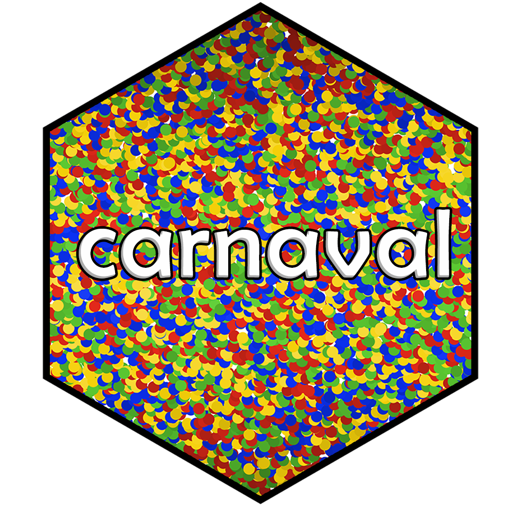
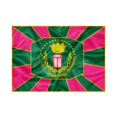

<!-- README.md is generated from README.Rmd. Please edit that file -->

# carnaval <a href="https://icarobernardes.github.io/carnaval/"></a>

<!-- badges: start -->

[](https://www.tidyverse.org/lifecycle/#experimental)
<!-- badges: end -->

Carnaval is the biggest street feast of Brazil. It happens all over the
country in a kaleidoscope of sound and color. One of its many shapes is
the yearly competition between Samba Schools in Rio.

The `carnaval` package provides easy access to both datasets on the
competition and color palettes inspired by the carioca Samba Schools.
The package focuses on the main league of the competition (“Grupo
Especial”).

Currently, all data comes from the [Galeria do
Samba](https://galeriadosamba.com.br) portal. If you like this package,
please help them keeping their project afloat:
[Contribua](https://galeriadosamba.com.br/espaco-aberto/contribua/).

The package is under development and has these functions:

- **get_scores:** Obtain scores of samba schools by year, school and/or
  criterion. Data goes back since 1968;

- **get_remarks:** Obtain remarks on the evaluation process. Data goes
  back since 1968;

- **get_parades:** Obtain total scores (and more) of samba schools by
  year and/or school. Data goes back since 1932;

- **display_all:** Plots the available Samba School palettes;

- **scale_ARG_rio_TYPE:** Family of ggplot functions for plotting with
  Samba School palettes. Can be used to fill or color/colour (ARG) and
  for discrete (d) or continuous (c) scales (TYPE);

- **colorblind_friendly:** Indicates whether a palette is friendly
  towards some types of colorblindness.

Script that builds the palettes is inspired by the
[`MetBrewer`](https://github.com/BlakeRMills/MetBrewer) package.
Colorblindness performance was checked using
[`colorblindcheck`](https://github.com/Nowosad/colorblindcheck).

## Installation and loading

Install `carnaval` from
[GitHub](https://github.com/IcaroBernardes/carnaval) as follows:

``` r
if (!require(devtools)) install.packages("devtools")
devtools::install_github("IcaroBernardes/carnaval")
```

## Examples

``` r
# Loads the package
library(carnaval)

# Prints a table that shows the scores of Portela and
# Estácio de Sá on the parades of 1968 and 1970 on all criterions
get_scores(years = c(1968, 1970), schools = c("portela", "Estácio de Sá"))
#> # A tibble: 52 × 6
#>    school         year score criteria                 judge_name         judge…¹
#>    <chr>         <dbl> <dbl> <chr>                    <chr>              <glue> 
#>  1 Estácio de Sá  1968     6 ALEGORIAS E ADEREÇOS     Napoleão Muniz Fr… judge1 
#>  2 Portela        1968    10 ALEGORIAS E ADEREÇOS     Napoleão Muniz Fr… judge1 
#>  3 Estácio de Sá  1968     7 BATERIA                  João de Barros  B… judge1 
#>  4 Portela        1968     9 BATERIA                  João de Barros  B… judge1 
#>  5 Estácio de Sá  1968     7 COMISSÃO DE FRENTE       Danúbio Menezes G… judge1 
#>  6 Portela        1968     9 COMISSÃO DE FRENTE       Danúbio Menezes G… judge1 
#>  7 Estácio de Sá  1968     4 CONJUNTO                 Ítalo de Oliveira  judge1 
#>  8 Portela        1968     4 CONJUNTO                 Ítalo de Oliveira  judge1 
#>  9 Estácio de Sá  1968     4 DESFILE NÃO INTERROMPIDO Maurício Shermann  judge1 
#> 10 Estácio de Sá  1968     2 DESFILE NÃO INTERROMPIDO Sandra Dicken      judge2 
#> # … with 42 more rows, and abbreviated variable name ¹​judge_number
```

``` r
# Loads ggplot2
library(ggplot2)

# Gets the scores of Império Serrano from 1968 until 2018 on the Bateria criterion.
# Throws some warnings to inform the user which years are absent of the data
# (either from missing info or because the school didn't compete in the main league)
df <- get_scores(years = 1968:2018, schools = "Império Serrano", criterions = "BATERIA")

# Creates a plot and applies manually the palette of Império Serrano
ggplot(data = df, aes(x = judge_number, y = score, fill = judge_number)) +
  geom_violin() +
  scale_fill_manual(values = rio_paletter("Imperio_Serrano", 5))
```

<!-- -->

## Palettes

### Beija Flor de Nilópolis


<br clear="both"/><br>

- Friendly towards **deuteranopia** and **protanopia**

------------------------------------------------------------------------

### Acadêmicos do Grande Rio


<br clear="both"/><br>

- Friendly towards **protanopia** and **tritanopia**

------------------------------------------------------------------------

### Imperatriz Leopoldinense


<br clear="both"/><br>

- Friendly towards **deuteranopia** and **tritanopia**

------------------------------------------------------------------------

### Império Serrano


<br clear="both"/><br>

- Friendly towards **deuteranopia**, **protanopia** and **tritanopia**

------------------------------------------------------------------------

### Estação Primeira de Mangueira



<br clear="both"/><br>

- Friendly towards **deuteranopia**, **protanopia** and **tritanopia**

------------------------------------------------------------------------

### Mocidade Independente de Padre Miguel


<br clear="both"/><br>

- Friendly towards **deuteranopia** and **tritanopia**

------------------------------------------------------------------------

### Paraíso do Tuiuti


<br clear="both"/><br>

- Friendly towards **deuteranopia**, **protanopia** and **tritanopia**

------------------------------------------------------------------------

### Portela


<br clear="both"/><br>

- Friendly towards **deuteranopia**, **protanopia** and **tritanopia**

------------------------------------------------------------------------

### Acadêmicos do Salgueiro


<br clear="both"/><br>

- Friendly towards **deuteranopia**, **protanopia** and **tritanopia**

------------------------------------------------------------------------

### São Clemente


<br clear="both"/><br>

- Friendly towards **deuteranopia**, **protanopia** and **tritanopia**

------------------------------------------------------------------------

### Unidos da Tijuca


<br clear="both"/><br>

- Friendly towards **deuteranopia**, **protanopia** and **tritanopia**

------------------------------------------------------------------------

### União da Ilha do Governador


<br clear="both"/><br>

- Friendly towards **deuteranopia**, **protanopia** and **tritanopia**

------------------------------------------------------------------------

### Unidos de Vila Isabel


<br clear="both"/><br>

- Friendly towards **deuteranopia**

------------------------------------------------------------------------

### Unidos do Viradouro


<br clear="both"/><br>

- Friendly towards **deuteranopia**, **protanopia** and **tritanopia**

## Credits

This package was created by [Ícaro
Bernardes](https://twitter.com/IcaroBSC).

The hex logo was created by [Bruno
Mioto](https://twitter.com/BrunoHMioto).
